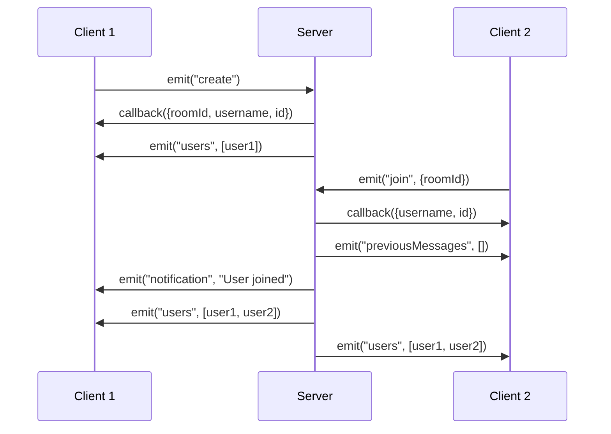
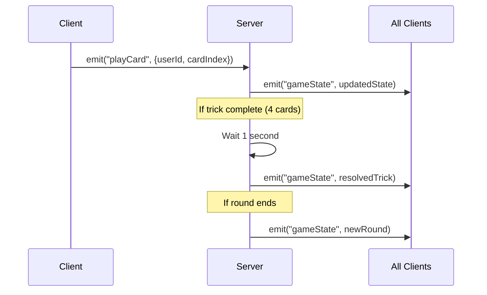
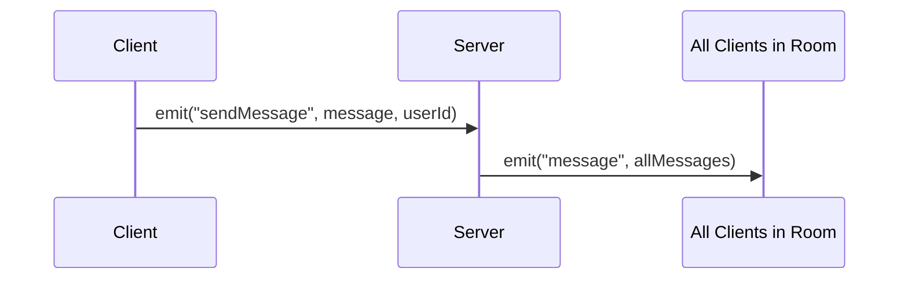

These events are emitted by the server using `io.emit()`, `socket.emit()`, or `io.to(roomId).emit()`. Clients should listen for these events to receive game updates.

## Room Updates

### users

Broadcast to all players in a room when the player list changes.

<ParamField body="users" type="User[]" required>
  Array of all users currently in the room
  
  **User Object:**
  ```typescript
  {
    id: string,        // User ID (UUID)
    socketId: string,  // Socket connection ID
    name: string,      // Display name
    roomId: string,    // Current room ID
    team: number       // Team assignment (0, 1, or 2)
  }
  ```
</ParamField>

<CodeGroup>
```javascript Listener
socket.on("users", (users) => {
  console.log(`${users.length} players in room`);
  users.forEach(user => {
    console.log(`${user.name} - Team ${user.team}`);
  });
});
```

```javascript Example Data
[
  {
    id: "550e8400-e29b-41d4-a716-446655440000",
    socketId: "abc123",
    name: "BraveTiger",
    roomId: "a3f5k9p2m1",
    team: 1
  },
  {
    id: "6ba7b810-9dad-11d1-80b4-00c04fd430c8",
    socketId: "def456",
    name: "CleverFalcon",
    roomId: "a3f5k9p2m1",
    team: 2
  }
]
```
</CodeGroup>

<Info>
**Triggered by:**
- Player joins the room (`join`, `create`)
- Player reconnects (`reconnect`)
- Player changes team (`changeTeam`)
- Player changes name (`changeName`)
- Player leaves the room (`leaveRoom`)
</Info>

---

### notification

Broadcast notification message to all players in a room.

<ParamField body="message" type="string" required>
  The notification message text
</ParamField>

<CodeGroup>
```javascript Listener
socket.on("notification", (message) => {
  console.log(`[Notification] ${message}`);
  // Display in UI notification area
});
```

```javascript Examples
"CleverFalcon has joined the room"
"BraveTiger has left the room"
"MightyPanda has reconnected"
```
</CodeGroup>

<Info>
**Triggered by:**
- Player joins the room
- Player leaves the room
- Player reconnects
</Info>

---

## Chat

### message

Broadcast chat messages to all players in the room.

<ParamField body="messages" type="Message[]" required>
  Array of all messages in the room (complete chat history)
  
  **Message Object:**
  ```typescript
  {
    user: string,  // Username of the sender
    text: string   // Message text
  }
  ```
</ParamField>

<CodeGroup>
```javascript Listener
socket.on("message", (messages) => {
  // Update chat display with all messages
  messages.forEach(msg => {
    console.log(`${msg.user}: ${msg.text}`);
  });
});
```

```javascript Example Data
[
  {
    user: "BraveTiger",
    text: "Hello everyone!"
  },
  {
    user: "CleverFalcon",
    text: "Ready to play!"
  }
]
```
</CodeGroup>

<Note>
This event sends the complete message history, not just the new message. Update your UI accordingly.
</Note>

---

### previousMessages

Sent to a specific player with chat history when they join or request it.

<ParamField body="messages" type="Message[]" required>
  Array of previous messages in the room
  
  **Message Object:**
  ```typescript
  {
    user: string,  // Username of the sender
    text: string   // Message text
  }
  ```
</ParamField>

<CodeGroup>
```javascript Listener
socket.on("previousMessages", (messages) => {
  // Load chat history
  console.log(`Loading ${messages.length} previous messages`);
  messages.forEach(msg => {
    console.log(`${msg.user}: ${msg.text}`);
  });
});
```
</CodeGroup>

<Info>
**Triggered by:**
- Player joins a room (`join`)
- Player reconnects (`reconnect`)
- Player requests chat history (`getPreviousMessages`)
</Info>

---

## Game State

### gameState

Sent to each player individually with the current game state.

<ParamField body="gameState" type="GameState" required>
  Complete game state object
  
  **GameState Object:**
  ```typescript
  {
    users: PlayerState[],      // Array of 4 players (in turn order)
    trumpCard: number,          // Trump card (1-49)
    state: string,              // "lobby" | "cardSwap" | "inGame" | "end"
    leadPlayer: number,         // Index of lead player (0-3)
    turn: number,               // Current turn offset (0-3)
    scores: [number, number]    // [team1Score, team2Score]
  }
  ```
  
  **PlayerState Object:**
  ```typescript
  {
    id: string,              // User ID
    name: string,            // Display name
    toSwap: number[],        // Cards selected for swap (sorted)
    cardPlayed: number,      // Card played in current trick (0 = none)
    hand: number[],          // Cards in hand (sorted, 1-49)
    team: number,            // Team assignment (1 or 2)
    tricksWon: number[][]    // Array of tricks won (each trick is array of 4 cards)
  }
  ```
</ParamField>

<CodeGroup>
```javascript Listener
socket.on("gameState", (gameState) => {
  console.log(`Game phase: ${gameState.state}`);
  console.log(`Trump card: ${gameState.trumpCard}`);
  console.log(`Scores: Team 1: ${gameState.scores[0]}, Team 2: ${gameState.scores[1]}`);
  
  // Find your player data
  const myPlayer = gameState.users.find(u => u.id === myUserId);
  console.log(`My hand: ${myPlayer.hand}`);
  console.log(`Tricks won: ${myPlayer.tricksWon.length}`);
});
```

```javascript Example Data
{
  users: [
    {
      id: "550e8400-e29b-41d4-a716-446655440000",
      name: "BraveTiger",
      toSwap: [],
      cardPlayed: 0,
      hand: [1, 8, 15, 22, 29, 36, 43, 9, 16, 23, 30, 37],
      team: 1,
      tricksWon: []
    },
    // ... 3 more players
  ],
  trumpCard: 25,
  state: "cardSwap",
  leadPlayer: 0,
  turn: 0,
  scores: [0, 0]
}
```
</CodeGroup>

<Info>
**Card Encoding:**
- Cards are numbered 1-49
- 0 represents no card (empty)
- Suits: Green (1-7), Yellow (8-14), Orange (15-21), Red (22-28), Pink (29-35), Purple (36-42), Blue (43-49)
- Ranks: 1 (Ace), 2-6, 7 (Seven) for each suit
- Special cards: 1 = Green Ace (Yokai), 49 = Blue 7 (highest Blue)
</Info>

<Warning>
Each player receives their own game state. In the future, this may be anonymized to hide opponent hands.
</Warning>

<Info>
**Triggered by:**
- Game starts (`startGame`)
- Cards are swapped (`swapCards` - when all players ready)
- Card is played (`playCard`)
- Trick is resolved (automatic after 1 second delay)
- Round ends (automatic when win condition met)
</Info>

---

## Game State Phases

<Tabs>
  <Tab title="lobby">
    **Lobby Phase**
    
    Players are joining and selecting teams. No game data is initialized yet.
    
    - Players can join/leave
    - Players can change teams and names
    - Game starts when 4 players are present and teams are filled
  </Tab>
  
  <Tab title="cardSwap">
    **Card Swap Phase**
    
    Cards have been dealt. Players select 3 cards to swap with their teammate.
    
    - Each player's hand has 12 cards
    - Players select exactly 3 cards to swap
    - Game automatically proceeds when all 4 players have selected cards
    - Cards are swapped across teammates (players 0↔2 and 1↔3)
  </Tab>
  
  <Tab title="inGame">
    **In-Game Phase**
    
    Active gameplay. Players take turns playing cards.
    
    - Lead player starts each trick
    - Players must follow suit if possible
    - Trick resolves automatically after 4 cards played
    - Winner of trick becomes new lead player
    - Round ends when win condition is met (4+ sevens, 7+ tricks, or all cards played)
  </Tab>
  
  <Tab title="end">
    **End Phase**
    
    Game has concluded.
    
    - Final scores displayed
    - Winner determined
    
    *Note: This phase is defined but may not be fully implemented in current version*
  </Tab>
</Tabs>

---

## Event Flow Examples

### Creating and Joining a Room



### Playing a Card



### Chat Message


